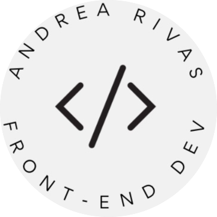

  
  
   

  <h1><b>Afghan Restaurant</b></h1>

# App Mocks
under construction ...
 

<!-- TABLE OF CONTENTS -->

# 📗 Table of Contents

- [📖 About the Project](#about-project)
  - [🛠 Built With](#built-with)
    - [Tech Stack](#tech-stack)
    - [Key Features](#key-features)
  - [🚀 Live Demo](#live-demo)
- [💻 Getting Started](#getting-started)
  - [Setup](#setup)
  - [Prerequisites](#prerequisites)
  - [Install](#install)
  - [Usage](#usage)
  - [Run tests](#run-tests)
  - [Deployment](#triangular_flag_on_post-deployment)
- [👥 Authors](#authors)
- [🔭 Future Features](#future-features)
- [🤝 Contributing](#contributing)
- [⭐️ Show your support](#support)
- [🙏 Acknowledgements](#acknowledgements)
- [❓ FAQ (OPTIONAL)](#faq)
- [📝 License](#license)

<!-- PROJECT DESCRIPTION -->

# 📖 Afghan Restaurant   

Afghan Restaurant is landing page of the Restaurant where you can see menu  specialties of the Restaurant and bunch of more things 

**Afghan Restaurant** is a react oriented website where we used various components and library

## 🛠 Built With 

### Tech Stack 

This is project where we applied our relevant skill set to complete our projects 

  
development

  <ul>
    <li><a href="https://reactjs.org/">React.js</a></li>
  </ul>

  
documentation

  <ul>
    <li><a href="https://html.com">Html</a></li>
  </ul>

styling

  <ul>
    <li><a href="">SCSS and Styled components</a></li>
  </ul>

<!-- Features -->

### Key Features 

- **Menu page**
- **Carousel**
- **banner with animation**
- **animation on scroll**

(<a href="#readme-top">back to top</a>)

<!-- LIVE DEMO -->

## 🚀 Live Demo 

under construction .........

(<a href="#readme-top">back to top</a>)

<!-- GETTING STARTED -->

## 💻 Getting Started 

>For having local file and project you can fork this repo 

>And for making changes you you should follow prerequisites

### Prerequisites
To edit this project you need:
 - Node.js installed
 - A Terminal 
 - A web browser
 - An IDE

 - suggested IDE
   - visual studio code
   - atom 
   - visual code 

### Setup

Clone this repository to your desired folder:

 - And run `npm i` in root dir <small>to install node modules</small>
 - Then run `npm run dev` or `npm start`
 - All this makes our project open  in the browser

### Usage

 Execute the following thing:
 
 - Stocks and State is manipulated by API 
 - details page with proper logo

### Run tests

- To run all test cases you need to run `npm test` in the root dir 
- Linters for files run in the root dir
  - `npx eslint "**/*.{js,jsx}` for JS or JSX linting
  - `npx stylelint "**/*.{css,scss}"`for CSS or SCSS linting
  - `npx hint .` for HTML linting
  - `--fix` flag for instant fixable fix
 

### Deployment

You can deploy this project using:
- Fork our Repo and clone it or download `zip` and extract it
- Edit some changes
- Run `npm run build` to make our project production ready
- deploy it using [GitHub](www.github.com) pages 
- or use Netlify or Render
 

(<a href="#readme-top">back to top</a>)

<!-- AUTHORS -->

## 👥 Authors 

👤 **Adarsh Pathak**

- GitHub: [@PowerLevel9000](https://github.com/PowerLevel9000)
- Twitter: [@PowerLevel9002](https://twitter.com/PowerLevel9002)
- LinkedIn: [Adarsh Pathak](https://linkedin.com/in/powerlevel)

👤 **Author2**

- GitHub: [@rivasbolinga](https://github.com/rivasbolinga)
- Twitter: [@AndreaRivasPal](https://twitter.com/AndreaRivasPal)
- LinkedIn: [andrea rivas palacios](https://www.linkedin.com/in/andrearivaspalacios/)

(<a href="#readme-top">back to top</a>)

<!-- FUTURE FEATURES -->

## 🔭 Future Features 

> Describe 1 - 3 features you will add to the project.

- [ ] **payment gateway**
- [ ] **Cart system**
- [ ] **QR scanner for gifts**

(<a href="#readme-top">back to top</a>)

<!-- CONTRIBUTING -->

## 🤝 Contributing 

Contributions, issues, and feature requests are welcome!

Feel free to check the [issues page](../../issues/).

(<a href="#readme-top">back to top</a>)

<!-- SUPPORT -->

## ⭐️ Show your support 

If you like this project please give it a star

(<a href="#readme-top">back to top</a>)

<!-- ACKNOWLEDGEMENTS -->

## 🙏 Acknowledgments 

I will like to mention @rivasbolinga for her expertise in field we are learning a lot together

(<a href="#readme-top">back to top</a>)

<!-- FAQ (optional) -->

<!-- LICENSE -->

## 📝 License 

This project is [MIT](./LICENSE) licensed.

(<a href="#readme-top">back to top</a>)
